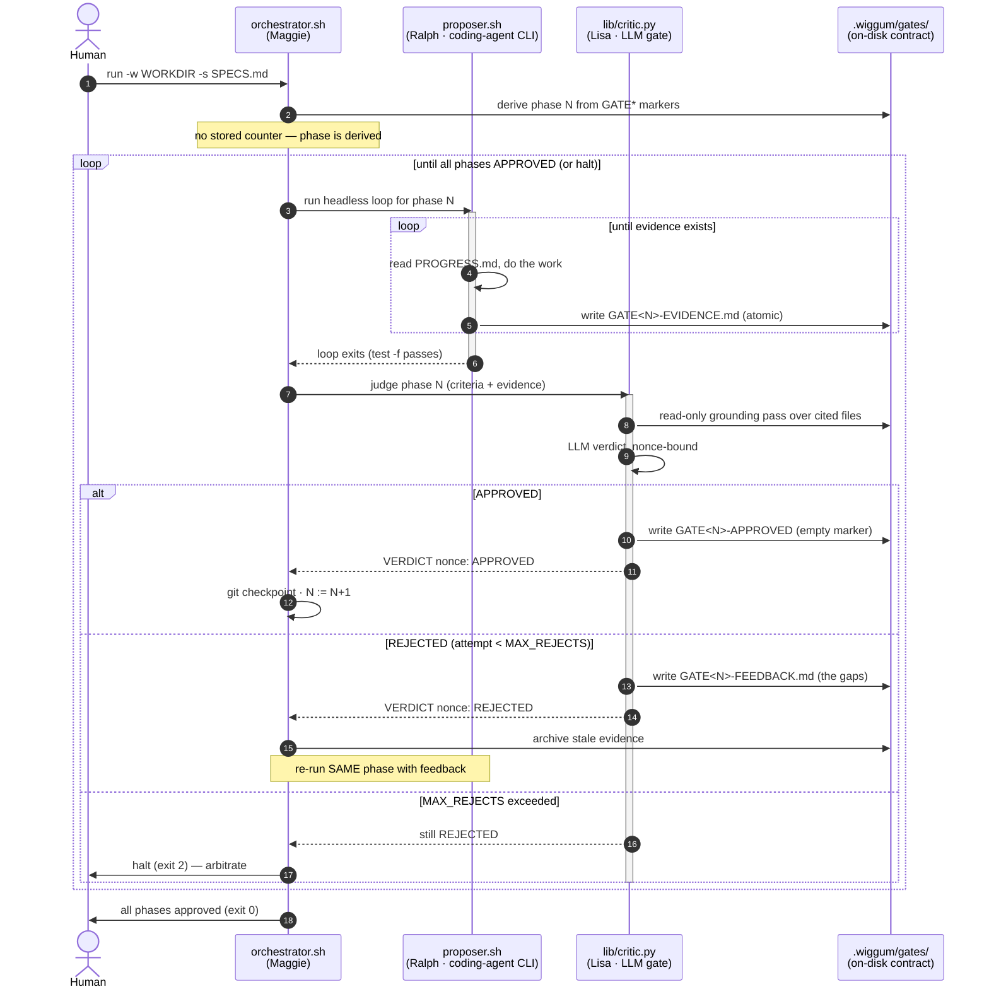

# Wiggum

**A self-driving, spec-driven Ralph loop with an agent pairing gate and telemetry.**


<br>


You hand it a `SPECS.md` — an ordered set of phases, each with acceptance
criteria — and it drives a coding agent phase by phase, but *nothing advances
until a critic approves it*. The human who used to eyeball each phase and click
"approved" is replaced by an LLM-backed critic. You stay out of the inner loop;
you only arbitrate the phases the machines genuinely can't settle.

The deterministic-loop approach — automating software development by running a
coding agent in a repeating, self-checking loop — is the **"Ralph" technique**
coined by [Geoffrey Huntley](https://ghuntley.com/). Wiggum is **my own
implementation and interpretation** of it: I arrived at this shape the hard way,
by running the loop *painfully by hand* — driving a coding agent phase by phase
and then sitting in the inner loop myself, eyeballing each phase's evidence and
hand-approving the gate before letting the next phase start. Doing that approval
step manually, over and over, is exactly the toil Wiggum removes: it adds an
**automated critic gate** in the seat I used to occupy, so nothing advances until
the work is verified — and I only step back in for the phases the machines
genuinely can't settle.

## The cast

<p align="center">
  
</p>

This is the one place the naming is explained. Everywhere else — code, files,
flags, env vars — uses the literal role names, so you never have to decode a joke
to operate the tool.

| Character | Role in the loop | In the code |
|---|---|---|
| **Ralph** (Ralph Wiggum — the Ralph loop, and this project's namesake) | the **proposer** that does the work | `proposer.sh`, `--proposer`, `WIGGUM_PROPOSER` |
| **Lisa** (the sharp one who checks Ralph's homework) | the **critic** that judges the evidence | `lib/critic.py`, `--critic`, `WIGGUM_CRITIC` |
| **Maggie** (silent, underestimated, secretly running the whole show) | the **orchestrator** that drives them both | `orchestrator.sh` |

From here on: **proposer** and **critic** mean exactly what they say.

The "Ralph loop" itself — looping a coding agent to build software autonomously —
is Geoffrey Huntley's technique (see the intro link); Wiggum is the proposer/critic
harness built around it.

## Wiggum is a utility; your project lives elsewhere

Install Wiggum once (clone it wherever you keep tools); it is *not* the working
directory. Each run points at your project:

- **`-w/--workdir DIR`** — where the proposer works. All generated state lives
  under `.wiggum/` — `PROGRESS.md` in `.wiggum/` and the gate files in
  `.wiggum/gates/` — so the workdir root holds only your real artifacts.
  Default: `$PWD`.
- **`-s/--specs FILE`** — the spec, **any name, any location** (`SPECS.md`,
  `ROADMAP.md`, `plan.md`, …). A relative path resolves against the directory you
  launched from, not the workdir. Default: `<workdir>/SPECS.md`.

So the same installed Wiggum drives any project:

```bash
wiggum -w ~/projects/foo -s ~/projects/foo/ROADMAP.md
```

(`wiggum` is the single front-door command — see **Install it permanently**
just below.)

The Bash entry points (`orchestrator.sh`, `proposer.sh`, `wiggum`) sit at the top
level; all Python components live under **`lib/`** (`lib/critic.py`,
`lib/present.py`, `lib/ralph_loki_ship.py`, `lib/ralph_otel_ship.py`).

### Install it permanently (one `wiggum` command)

Typing `/root/wiggum/orchestrator.sh …` every run gets old fast. Set it up once in
your shell rc so a **single `wiggum` command** is the front door for *everything* —
`wiggum -w …` **starts** the loop (on `orchestrator.sh`'s behalf) and
`wiggum status`, `wiggum watch`, `wiggum stop`, … run the inspection CLI. No code
change; it's just a small dispatcher function that routes by the first word.

Add this to `~/.bashrc` (or `~/.zshrc`):

```bash
# ── Wiggum ─────────────────────────────────────────────────────────────
export WIGGUM_HOME="/root/wiggum"          # wherever you cloned it — set once
export WIGGUM_LIVE_DETAIL=full             # richest live view — narrates assistant text + every tool call

wiggum() {
  # inspection verbs go to the CLI; anything else starts a run.
  case "$1" in
    status|phases|tail|events|verdicts|feedback|watch|stop|resume|-h|--help|"")
      "$WIGGUM_HOME/wiggum" "$@" ;;         # the read-only inspection CLI
    run|start)                              # explicit "start a run" verb
      shift; "$WIGGUM_HOME/orchestrator.sh" "$@" ;;
    *)                                      # e.g. `wiggum -w DIR …`  → launch
      "$WIGGUM_HOME/orchestrator.sh" "$@" ;;
  esac
}
# ───────────────────────────────────────────────────────────────────────
```

Reload once (`source ~/.bashrc`) and the one command drives every example below,
from any directory:

```bash
wiggum -w ~/projects/foo -s ~/projects/foo/ROADMAP.md   # START a loop
wiggum run -w ~/projects/foo                            # …same thing, explicit verb
wiggum status -w ~/projects/foo                         # inspect it
wiggum watch  -w ~/projects/foo                         # live status card
wiggum stop   -w ~/projects/foo                         # clean halt
```

Because the launch path is anything that isn't an inspection verb, `wiggum` with a
`-w/-s/--flag` first argument goes straight to the orchestrator, while the reserved
verbs above always reach the CLI. Use the explicit **`wiggum run …`** form whenever
you want to be unambiguous (or in scripts).

> **Why a function and not a `symlink`/PATH shim?** The scripts locate their own
> `lib/` and `wiggum-lib.sh` via `dirname "${BASH_SOURCE[0]}"`, which does **not**
> dereference symlinks — a `ln -s … /usr/local/bin/wiggum` would resolve its home
> to `/usr/local/bin` and fail to find `wiggum-lib.sh`. The function calls the real
> absolute paths under `$WIGGUM_HOME`, so `SCRIPT_DIR` stays correct. (Prefer PATH?
> `export PATH="$WIGGUM_HOME:$PATH"` also keeps the real directory — but then
> `wiggum` alone only reaches the inspection CLI, and you'd still call
> `orchestrator.sh` by name to start a run. The function is what unifies both.)

The rest of this README uses the unified **`wiggum`** command — `wiggum -w …` (or
`wiggum run …`) to start, `wiggum <verb> …` to inspect — as if you've added the
function above. Without it, substitute `"$WIGGUM_HOME"/orchestrator.sh` to start and
`"$WIGGUM_HOME"/wiggum` for the CLI verbs.

## How it works

```
orchestrator.sh   (derives the current phase N from disk; reads SPECS.md)
  │
  ├─(1) PROPOSER — run a headless coding-agent loop for phase N until it writes
  │       .wiggum/gates/GATE<N>-EVIDENCE.md (written atomically), then the loop exits.
  │
  ├─(2) CRITIC — lib/critic.py reads phase N's acceptance criteria + the evidence,
  │       does a read-only grounding pass over the files the evidence cites, and
  │       asks an LLM for a strict verdict:
  │           APPROVED → writes an empty .wiggum/gates/GATE<N>-APPROVED marker
  │           REJECTED → writes .wiggum/gates/GATE<N>-FEEDBACK.md (the specific gaps)
  │
  ├─(3a) APPROVED → git-checkpoint the workdir, N := N+1, back to (1).
  └─(3b) REJECTED → archive the rejected evidence, re-run the proposer for the
           SAME phase with the feedback. Bounded by MAX_REJECTS; on exceed, halt
           and leave everything on disk for a human.
```

The same loop as a UML sequence — the three roles (orchestrator = *Maggie*,
proposer = *Ralph*, critic = *Lisa*) and the approve/reject branch, all mediated
by the `.wiggum/gates/` files rather than direct calls:



There is **no file-watcher**. Detection is deterministic: the proposer loop's
gate is a plain `test -f .wiggum/gates/GATE<N>-EVIDENCE.md`, and because that loop has already
exited when control returns, the orchestrator hands the critic the exact path —
no race, no half-written file.

## Quick start

Clone, set your key, alias, run:

```bash
cp .env.example .env          # then edit: set ANTHROPIC_API_KEY

# one-time setup (see "Install it permanently" above): paste the wiggum()
# function into ~/.bashrc, pointing WIGGUM_HOME at this clone, then reload:
source ~/.bashrc

mkdir -p /tmp/wiggum-demo && cp SPECS.example.md /tmp/wiggum-demo/SPECS.md
wiggum -w /tmp/wiggum-demo
```

(Not set up yet? The one-off equivalent is `"$WIGGUM_HOME"/orchestrator.sh -w
/tmp/wiggum-demo` — or `./orchestrator.sh -w /tmp/wiggum-demo` from inside the clone.)

`main` defaults both roles to **`claude`** (Claude Code CLI for the proposer,
the Claude Messages API for the critic), so a clone plus an Anthropic key runs
out of the box. The bundled `SPECS.example.md` is two trivial, verifiable phases
so you can watch the whole loop — including a reject-and-fix — end to end.

### Default run (this install)

Drive the local `image_generator` spec with the most detailed live view, shipping
telemetry to the host's Grafana:

```bash
WIGGUM_LIVE_DETAIL=full wiggum \
    -w /root/image_generator \
    -s /root/image_generator/SPECS.md \
    --telemetry --loki-url http://localhost:3100
```

`WIGGUM_LIVE_DETAIL=full` is the most detailed live view (see **Live visibility**);
the run is resumable with `wiggum resume -w /root/image_generator`. **Telemetry note:**
wiggum's *bundled* stack (`telemetry/`) defaults to Grafana `:3010` / Loki `:3110`,
but this host's *live* observability stack is Grafana **`:3000`** / Loki **`:3100`** —
so point `--loki-url` at **`:3100`**. Runs then land under `task="image_generator"` in
`{job="ralph"}`. The **"Ralph Loops (Claude Code)"** dashboard defaults to a `now-6h`
window — widen it to **24h** if you don't see a recent run.

## Live visibility (on by default)

A backgrounded loop is not a black box. Every meaningful step emits one
structured event, and a **presenter** renders it in real time — in **full color**,
with **zero containers**. Two views over the same event stream:

- **Inline timeline (`--live`, auto-on at a TTY):** when you launch the
  orchestrator in a terminal, it streams a clean, colored, scrolling timeline
  **right there** — like watching a coding agent work — while the noisy raw
  proposer/critic output goes to `run.log` only. The proposer's agent stream is
  narrated as it happens: each tool call gets its **own color and glyph** (Read
  `◎`, Write `✚`, Edit `✎`, Bash `❯`, Grep/Glob `❍`, …), timestamps recede to
  gray so the action carries the color, and every end-of-pass line shows the
  **cost / tokens / duration / turns** each tinted. Whenever the agent goes quiet
  for more than a couple of seconds, an animated **heartbeat** (spinner + pulse
  bar) keeps the current activity and running totals visibly moving. No second
  terminal, no `wiggum watch`. Color auto-strips when stdout isn't a TTY, or force
  it off with `--no-color`; force the whole view off with `--no-live` (restores the
  raw tee'd output).
  ```
  14:02:41  ◎ Read  proposer.sh
  14:02:43  ❯ Bash  npm test
  14:02:44  ⠹▄ proposer working · 3s  · run $0.04 · 12.1k tok out · 1 pass · 41s
  14:03:02  ⏺ pass done · $0.12 · 5.1k tok · 18s · 12 turns
  14:03:03  ✓ evidence → GATE2-EVIDENCE.md  (1 iter)
  14:03:19  ✗ REJECTED phase 2 (attempt 1) — criterion 3: no passing test
  ```
  **Verbosity** is `WIGGUM_LIVE_DETAIL` (`milestones | tools | full`; default
  `tools`). Set it in `.env` or inline per run. `full` adds each assistant
  thinking/narration line (`💬`) on top of the tool calls — the most detailed view:

  ```bash
  WIGGUM_LIVE_DETAIL=full wiggum -w ~/projects/foo --live
  ```

  (`milestones` is the sparsest — only coarse loop milestones, no per-tool lines.)

- **Live status card:** `wiggum watch` — a compact header (phase progress + current
  activity + heartbeat) over a **scrolling recent-activity feed**, so the latest
  message is always visible in place without scrolling. Attach to a backgrounded run.
  Honors `WIGGUM_LIVE_DETAIL` the same way:
  ```bash
  WIGGUM_LIVE_DETAIL=full wiggum watch -w ~/projects/foo
  ```

## The `wiggum` inspection CLI

Everything is read-only **except `stop` and `resume`** — those are the only two
subcommands that mutate a run (they write `stop.flag` / relaunch the orchestrator).

| Command | Shows / does |
|---|---|
| `wiggum status [-w DIR] [-s SPEC]` | one-screen state: a run-state headline (RUNNING / STOPPED / HALTED / DONE) + current phase + a ✓/✗ table of which contract files exist |
| `wiggum phases [-w DIR] [-s SPEC]` | phases parsed from the spec + each one's state (also lints the spec) |
| `wiggum tail   [-w DIR]` | `tail -f` the orchestrator `run.log` (the raw log) |
| `wiggum events [-w DIR] [-f\|--follow] [--json]` | the raw event stream ("RPC view"): every milestone **and** every agent tool call / message as `HH:MM:SS event key=value…` lines. `--follow` streams; `--json` emits the raw JSONL |
| `wiggum verdicts [-w DIR] [N]` | the critic's full reply(ies): prompt + response + parse decision |
| `wiggum feedback <N> [-w DIR]` | `GATE<N>-FEEDBACK.md` |
| `wiggum watch  [-w DIR]` | the live status card (with heartbeat + run totals) |
| `wiggum stop   [-w DIR] [--now]` | **(mutates)** request a clean stop — writes `stop.flag`; the run finishes its current pass and exits 6. `--now` also kill-trees the in-flight proposer pass (via `.wiggum/proposer.pid`) so it stops within seconds |
| `wiggum resume [-w DIR] [overrides…]` | **(mutates)** relaunch the orchestrator from the saved config of the last run (`.wiggum/last-run.conf`); refuses if a run is already active. Extra args override the saved flags (last-wins) |

## The on-disk contract

`SPECS.md` is the one input you write; it can live anywhere (`-s`). Everything
else Wiggum generates lives under `.wiggum/gates/`, so the workdir root stays
clean — only your real project artifacts sit there.

| File | Written by | Meaning |
|---|---|---|
| `SPECS.md` | you | Ordered phases + acceptance criteria (the input). |
| `.wiggum/PROGRESS.md` | proposer | Durable state; read first each iteration. |
| `.wiggum/gates/GATE<N>-EVIDENCE.md` | proposer | Evidence phase N's criteria are met. Written atomically. |
| `.wiggum/gates/GATE<N>-APPROVED` | **critic** | Empty marker; unblocks phase N+1. |
| `.wiggum/gates/GATE<N>-FEEDBACK.md` | **critic** | Present after a REJECT; the gaps to fix. |
| `.wiggum/` | orchestrator | State dir (see below). The current phase is **derived** from the `GATE*` markers, never stored. |

`.wiggum/` holds: `gates/` (all the phase-control files above — this is the one
place to look for what the loop produced), `runs/<run-id>/{run.log,events.jsonl}` (each run isolated;
stable `run.log`/`events.jsonl` symlinks point at the newest), `stop.flag`,
`lock`, `last-run.conf` (the `%q`-escaped, sourceable config of the last launch —
what `wiggum resume` replays), `proposer.pid` (the in-flight proposer pass, so
`wiggum stop --now` can kill the tree; removed when the pass ends), `verdicts/`
(critic transcripts), `attempts/phase<N>/attempt<M>/` (archived rejected attempts
— the full audit trail), and `debug/`.

### The event stream

Every meaningful step appends one JSON object (one per line) to
`.wiggum/events.jsonl`; `wiggum events` and the live views render it. Lifecycle
events come from the orchestrator/proposer; the `agent_*` and `evidence_writing`
events come from the proposer's stream-json tap (`lib/agent_stream.py`, gated by
`WIGGUM_AGENT_STREAM`).

| Event | Emitted by | Meaning |
|---|---|---|
| `run_start` / `run_end` | orchestrator | a run begins / all phases approved (`outcome`) |
| `run_stop` | orchestrator | run halted early — `reason` (`stop_flag`, `wall_budget`, `max_rejects`, `proposer_max_iter`, `proposer_no_evidence`, `critic_config`) + `phase` |
| `phase_start` / `phase_done` | orchestrator | phase N entered / approved |
| `proposer_start` | orchestrator | a proposer pass for phase N begins |
| `iter_start` / `iter_done` | proposer | one headless proposer iteration |
| `evidence_written` / `evidence_present` | proposer | `GATE<N>-EVIDENCE.md` was just written / already existed |
| `attempt_archived` | orchestrator | a rejected evidence file was archived before retry |
| `verdict` | critic | the critic's APPROVED/REJECTED decision |
| `reject` | orchestrator | phase N rejected (attempt M) with feedback |
| `git_checkpoint` / `gates_migrated` | orchestrator | per-phase commit / one-time gate-file relocation |
| `agent_init` | agent tap | once per pass: model + tool count |
| `agent_tool` | agent tap | every proposer tool call: tool name + compact target |
| `agent_text` | agent tap | first line of each assistant message (thinking/narration) |
| `agent_result` | agent tap | end of pass: cost, tokens, duration, turns |
| `evidence_writing` | agent tap | first Write/Edit/Bash of the pass that touches a `GATE<N>-EVIDENCE.md` |
| `_reopen` | presenter | **synthetic**, not on disk: the `events.jsonl` symlink retargeted (a new run after stop+resume), so a following viewer prints a divider and keeps narrating |

### `SPECS.md` phase format

Each phase is a level-2 heading whose text starts with `Phase <N>`, containing an
`### Acceptance criteria` block:

```markdown
## Phase 0 — <title>
<description of the work>

### Acceptance criteria
- [ ] criterion one
- [ ] criterion two
```

## Configuration

Everything is set in `.env` (copy from `.env.example`; the real `.env` is
gitignored). Precedence: **built-in defaults < `.env` < CLI flags**.

Pick a backend per role — `claude | codex | bebop`:

- **`claude`** — Anthropic. Claude Code CLI (proposer) + Messages API (critic).
- **`codex`** — OpenAI. Codex CLI (proposer) + Chat Completions (critic).
  Ships, but **UNVERIFIED** (no Codex CLI on the author's host to test against).
- **`bebop`** — a local selector → Compass/qwen via a shim (host-specific).

Key knobs (see `.env.example` for all of them): `WIGGUM_MAX_REJECTS` (3),
`WIGGUM_MAX_ITER`, `WIGGUM_PROPOSER_TIMEOUT` (1800s),
`WIGGUM_CRITIC_TIMEOUT` (300s), `WIGGUM_MAX_WALL_MIN` (0 = unlimited),
`WIGGUM_CRITIC_GROUNDING` (on), `WIGGUM_GIT_COMMITS` (auto).

## Hardening

An unattended approve-your-own-work loop invites specific failure modes; each is
guarded, all cheap:

- **Nonce-bound verdict.** The critic must end with `VERDICT <nonce>: APPROVED|REJECTED`,
  where `<nonce>` is random per call. The verdict is parsed **only from the
  critic's reply**, so a proposer can't approve its own gate by writing
  `VERDICT …: APPROVED` into the evidence. Missing/duplicate/wrong-nonce/ambiguous
  → REJECTED (fail-safe: never auto-approve on doubt).
- **Grounded critic.** Before the LLM call, the critic verifies the files the
  evidence cites (exists/size/mtime + bounded excerpt) and appends that snapshot,
  so claims about missing/empty files are visible. Read-only — never executes.
- **Stale-evidence rule.** On REJECT the rejected `GATE<N>-EVIDENCE.md` is
  archived before the retry, so the proposer's file-existence gate isn't
  instantly satisfied by the old file (which would make "retry" a no-op).
- **Single-run lock, timeouts, wall budget, `stop.flag`.** One orchestrator per
  workdir; per-pass and per-critic-call timeouts; an optional whole-run
  wall-clock budget; a manual clean halt.
- **Crash-safe resume.** The current phase is *derived* from the `GATE*` markers
  on start, not from a stored counter. Kill it anywhere, rerun the same command,
  it continues. `--start-phase N` overrides.
- **Per-phase git checkpoint.** After each `GATE<N>-APPROVED`, if the workdir is
  a git repo with changes, the orchestrator commits
  `wiggum: phase <N> approved — <title>`. Never inits, never pushes.

## Exit codes

| Code | Meaning |
|---|---|
| `0` | all phases approved |
| `1` | unexpected/internal error |
| `2` | MAX_REJECTS exceeded — a human needs to arbitrate |
| `3` | invalid spec/config |
| `4` | budget exceeded (wall clock or MAX_ITER) |
| `5` | lock held by another run |
| `6` | stopped via `stop.flag` (clean; `wiggum resume` or rerun continues). Now also produced when the stop lands **mid-proposer** — `wiggum stop --now` — which earlier versions mislabeled as `4` |

## Optional telemetry

Off by default; the loop is fully legible with zero containers. When you want a
dashboard too, wiggum has **two independent telemetry backends** — enable either or
**both at once** (dual-ship):

| Backend | Flag | URL flag (its own — never crossed) | Default | Ships to |
|---|---|---|---|---|
| **Loki** | `--telemetry` | `--loki-url` | `:3100` | Loki push API directly |
| **OpenTelemetry** | `--otel` | `--otel-url` | `:4318` | the OTLP **Collector** (which then feeds Loki + Prometheus) |

The two are wired separately: `--loki-url` **only** configures the Loki sink and
`--otel-url` **only** configures the OTEL sink. They do not share a URL — pointing
`--otel-url` at your Loki push port (or `--loki-url` at the Collector) will not work.

### Loki

`--telemetry` ships the event stream straight to Loki's push API:

```bash
(cd "$WIGGUM_HOME/telemetry" && docker compose up -d)   # Grafana :3010, Loki :3110 (both free here)
wiggum --telemetry --loki-url http://localhost:3110 -w ./myproject
# open http://localhost:3010 → the "Ralph Loops" dashboard
```

This is an independent deployment on its own ports (the defaults deliberately
avoid the common :3000/:3100). Every port is an `.env` variable.

### OpenTelemetry (OTLP)

`--otel` ships the *same* event stream over **OTLP/HTTP+JSON** to the bundled OTEL
Collector, which forwards logs to the same Loki (so the "Ralph Loops" dashboard is
unchanged) and turns cost/tokens/duration into first-class **Prometheus** metrics
(`ralph_cost_usd_total`, `ralph_tokens_total`, `ralph_iter_duration_ms`, …). Like
`--telemetry`, it's stdlib-only — no OTEL SDK, no pip:

```bash
(cd "$WIGGUM_HOME/telemetry" && docker compose up -d)   # + otel-collector :4318, Prometheus :9091
wiggum --otel --otel-url http://localhost:4318 -w ./myproject
```

The OTEL sink is driven **only** by `--otel` / `--otel-url` (env `WIGGUM_OTEL_URL`) —
never by `--loki-url`. Note `--otel-url` points at the **Collector** on `:4318`, not
at Loki: the Collector is what fans OTLP out to Loki (logs) and Prometheus (metrics).
So a `--loki-url` change never affects OTEL, and vice versa.

`--telemetry` and `--otel` are **independent**: run either alone, or **both at once
to dual-ship** (Loki push *and* OTLP in parallel) — handy while migrating. To send
telemetry over OTEL only, pass `--otel` without `--telemetry`:

```bash
wiggum --otel --otel-url http://localhost:4318 -w ./myproject          # OTEL only
wiggum --telemetry --loki-url http://localhost:3110 \
       --otel      --otel-url http://localhost:4318 -w ./myproject      # both (dual-ship)
```

The shipper `lib/ralph_otel_ship.py` mirrors the Loki shipper's `add()`/`flush()`
seam and is covered by unit, characterization, and old-vs-new **parity** tests
(`python3 lib/test_ralph_otel_ship.py`, `lib/test_telemetry_parity.py`).

## Branches

Code is provider-agnostic and lives entirely on `main`. Branches differ *only* in
`.env` defaults:

- **`main`** — defaults to `claude`; clone + Anthropic key runs.
- **`bebop`** — overlay; defaults both roles to `bebop compass` (author's host).
- **`codex-demo`** — overlay; defaults both roles to `codex` (OpenAI-only demo).
