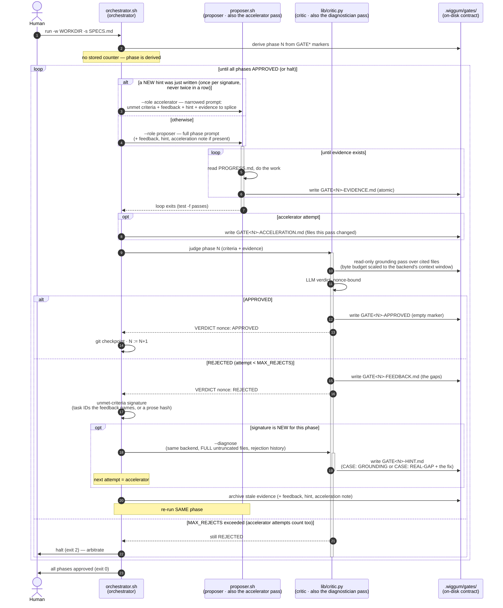

# Architecture

Wiggum is three roles communicating **only through files** under `.wiggum/gates/`. No role
calls another directly; the on-disk gate files *are* the contract.

## The loop

```
orchestrator.sh   (derives the current phase N from disk; reads the spec)
  │
  ├─(1) PROPOSER — run a headless coding-agent loop for phase N until it writes
  │       .wiggum/gates/GATE<N>-EVIDENCE.md (atomically), then the loop exits.
  │
  ├─(2) CRITIC — lib/critic.py reads phase N's acceptance criteria + the evidence,
  │       does a read-only grounding pass over the files the evidence cites, and
  │       asks an LLM for a strict verdict:
  │           APPROVED → writes an empty .wiggum/gates/GATE<N>-APPROVED marker
  │           REJECTED → writes .wiggum/gates/GATE<N>-FEEDBACK.md (the specific gaps)
  │
  ├─(3a) APPROVED → git-checkpoint the workdir, N := N+1, back to (1).
  └─(3b) REJECTED → archive the rejected evidence, re-run the proposer for the
           SAME phase with the feedback. Bounded by MAX_REJECTS; on exceed, halt
           and leave everything on disk for a human.
```

## The roles

Literal role names are used everywhere — code, files, flags, env vars. Three scripts, five passes:

| Role | Script | Job |
|---|---|---|
| **Orchestrator** | [`orchestrator.sh`](../orchestrator.sh) | Derives the current phase from `GATE*` markers, drives proposer↔critic, checkpoints on approval, archives on reject, tracks each phase's unmet-criteria signature, enforces budgets/locks. |
| **Proposer** | [`proposer.sh`](../proposer.sh) | Runs a headless coding-agent CLI in a fresh-context loop until phase N's `GATE<N>-EVIDENCE.md` exists. |
| **Critic** | [`lib/critic.py`](../lib/critic.py) | Reads criteria + evidence, grounds cited files (read-only, byte budget scaled to the backend's context window), asks the LLM for a nonce-bound verdict. |
| **Diagnostician** | `lib/critic.py --diagnose` | Fires once per NEW unmet-criteria signature: same critic backend, the FULL untruncated cited files, no grounding budget. Writes `GATE<N>-HINT.md` (`CASE: GROUNDING` or `CASE: REAL-GAP` + the fix). Advisory only. `WIGGUM_DIAGNOSTICIAN=false` disables. |
| **Accelerator** | `proposer.sh --role accelerator` | The attempt right after a new hint: the proposer with a prompt narrowed to the unmet criteria, the feedback, the hint and the evidence to splice. Once per hint, never twice in a row, counts toward `MAX_REJECTS`; writes `GATE<N>-ACCELERATION.md` for the next wide pass. `WIGGUM_ACCELERATOR=false` disables. |

## Sequence



## No file-watcher

Detection is deterministic, not event-driven. The proposer loop's gate is a plain
`test -f .wiggum/gates/GATE<N>-EVIDENCE.md`. Because that loop has **already exited** when
control returns to the orchestrator, the orchestrator hands the critic the exact path — no
race, no half-written file, nothing to poll. Evidence is written atomically (temp file +
rename) so the critic never observes a partial write.

## Phase is derived, never stored

There is no counter file. On every start the orchestrator scans the `GATE*` markers on disk
and resumes at the first phase lacking a `GATE<N>-APPROVED`. Kill the run anywhere, rerun the
same command, and it continues. `--start-phase N` overrides. This is what makes the loop
crash-safe (see [Hardening](Hardening)).

## The Python components

All Python lives under [`lib/`](../lib); the Bash entry points stay at the top level.

| Component | Role |
|---|---|
| `lib/critic.py` | The critic — grounding pass + LLM verdict + nonce parsing |
| `lib/wiggum_spec.py` | The single spec-parsing source of truth (bash and critic both delegate) — see [Spec Formats](Spec-Formats) |
| `lib/verification_plan.py` | Pre-loop `VerificationPlan v1` derivation + test scaffolding |
| `lib/agent_stream.py` | The proposer's stream-json tap that emits `agent_*` events |
| `lib/present.py` | The live presenter (inline timeline + status card) |
| `lib/ralph_loki_ship.py` / `lib/ralph_otel_ship.py` | The two telemetry shippers |
| `lib/verdict_pins.py` | Verdict-parsing pins/guards |

Next: [On-Disk Contract](On-Disk-Contract) · [Hardening](Hardening)
